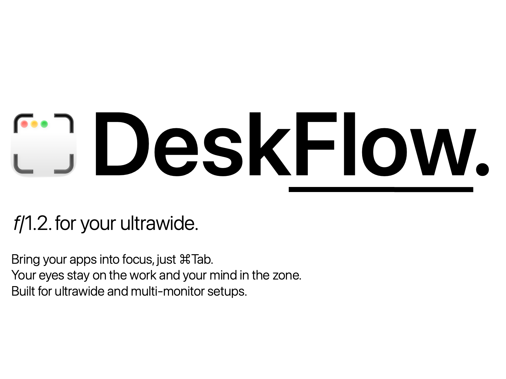

  

  <a href="https://caestudy.com/deskflow">caestudy.com/deskflow</a>

---

## Download

Get the latest release from the [Releases](../../releases/latest) page.

**Requires macOS Sonoma 14.0 or later.**

---

## Features

**Focus Zone** — Make the app come to you.
DeskFlow defines a focus zone - your primary field of view where your active app always lands. ⌘Tab to anything and it flows there.

**UltraFocus** — Disappear into the work.
With a hotkey, UltraFocus dims the entire screen, menu bar and dock included, leaving only the one app in your focus zone. Nudge the pointer to a screen edge to peek at either without breaking focus.

**Multi-Display** — Control all of your displays.
Zones are defined per display, landscape or portrait. Every arrangement keeps its own layout, restored on reconnect. Window placements are captured per arrangement and restored at startup. Apps can be exempted from zone management when you need them to roam free, and Ctrl+⌘H snaps one back to its remembered place on demand.

**Low Overhead** — Zero interference. Nothing to unlearn.
Runs on ⌘Tab. Additional hotkeys live in a dedicated Ctrl+⌘ namespace, chosen not to conflict with your terminal, Xcode, VS Code, Raycast, and Rectangle.

---

## Support & Feedback

Join the DeskFlow Discord: [discord.gg/AEjaHm9m](https://discord.gg/AEjaHm9m)

Report bugs or share ideas directly with the developer.

---

  A <a href="https://caestudy.com">cæstudy</a> product

